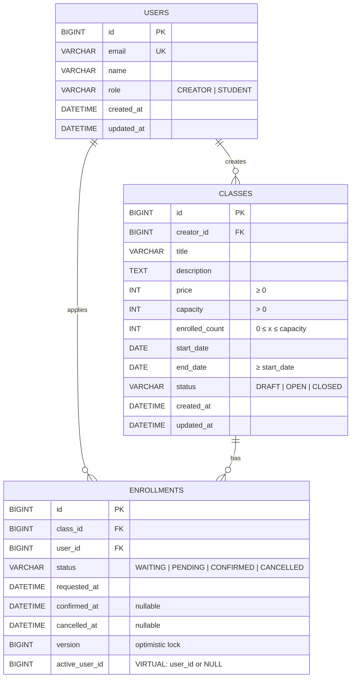
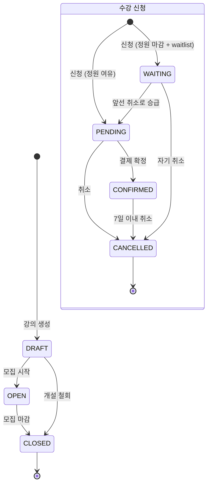

# BE-A 수강 신청 시스템

라이브클래스 스타일의 강의 개설 및 수강 신청을 다루는 Spring Boot 기반 백엔드 과제 제출물입니다.

## 프로젝트 개요

크리에이터가 강의를 개설하고, 수강생이 신청, 결제, 취소하는 흐름을 다루는 시스템입니다.

주요 기능
- 크리에이터 강의 생성, 수정, 삭제, 상태 전환 (`DRAFT` → `OPEN` → `CLOSED`)
- 수강 신청 및 대기열(waitlist) 기반 자동 승급
- 결제 확정(`PENDING` → `CONFIRMED`), 7일 이내 수강 취소
- 내 수강 신청 목록 / 크리에이터 전용 수강생 목록 조회
- 동시 마지막 자리 신청, 대기열 승급 vs 취소 등 주요 경합 시나리오 방어

## 참고 문서

- [`docs/analyze-requirements.md`](docs/analyze-requirements.md): 기존 요구사항 분석을 바탕으로 구현 범위, 상태 전이, 정원 관리 규칙을 구체화한 문서
- [`docs/implementation-plan.md`](docs/implementation-plan.md): 기능 구현 순서, 동시성 전략, 테스트 계획을 정리한 구현 계획 문서
- [`docs/feature-work-doc.md`](docs/feature-work-doc.md): 기능별 진행 상태와 완료 기준을 체크리스트로 관리한 작업 문서

## 기술 스택

| 범주 | 선택 |
|------|------|
| 언어 | Java 17 |
| 프레임워크 | Spring Boot 3.5.7 (Web, Validation, Data JPA) |
| DB | MySQL 8.4 |
| 마이그레이션 | Flyway (V1~V4) |
| ORM | Spring Data JPA (Hibernate) |
| API 문서 | springdoc-openapi 2.8.17 (Swagger UI) |
| 테스트 | JUnit 5, Spring Boot Test, Testcontainers (MySQL) |
| 빌드 | Gradle |
| 런타임 | Docker Compose (MySQL) |

## 실행 방법

### 1. 로컬 실행 (Docker + Gradle)
```bash
# MySQL 컨테이너 기동
docker compose up -d

# 애플리케이션 실행 (기본 profile: local, 포트 8080)
./gradlew bootRun
```

### 2. 확인
- Swagger UI: http://localhost:8080/swagger-ui.html
- OpenAPI JSON: http://localhost:8080/api-docs
- DB: `localhost:3306` / `enrollment` DB / `enrollment`:`enrollment`

### 3. 종료
```bash
docker compose down      # 데이터 유지
docker compose down -v   # 볼륨까지 제거
```

시드 데이터(`users` 3건)는 `V1__init.sql`에서 자동 삽입

## 요구사항 해석 및 가정

요구사항 원문이 모호하거나 열려 있는 지점에 대해 아래와 같이 해석

### 상태 전이
- **강의**: `DRAFT ↔ OPEN → CLOSED` 단방향. `CLOSED`에서는 수정, 되돌리기 모두 차단
- **수강 신청**: `PENDING → CONFIRMED → CANCELLED` 및 `WAITING → PENDING → CONFIRMED → CANCELLED`. `CANCELLED`는 최종 상태지만, 동일 (class, user)에 대한 **재신청은 허용**

### 정원 정의
- 정원 카운트 대상: `PENDING` + `CONFIRMED` (활성 수강 신청)
- `WAITING`은 정원 외부
- 불변식: `0 ≤ enrolled_count ≤ capacity` 그리고 `enrolled_count == COUNT(PENDING+CONFIRMED)`

### 취소 기간 (선택 구현)
- `CONFIRMED` 이후 **7일 이내**만 취소 가능 (경계값 포함: 7일째 가능, 8일째부터 `CANCEL_PERIOD_EXPIRED`)
- `PENDING` / `WAITING`은 기간 제한 없음

### 대기열 (선택 구현)
- 정원 마감 시 `waitlist=true`면 `WAITING`으로 저장
- `PENDING`/`CONFIRMED` 취소로 좌석이 복구되면 **가장 오래된 `WAITING`** 을 `PENDING`으로 자동 승급
- `CLOSED` 강의에서는 승급 스킵
- `WAITING` 자기취소는 정원에 영향 없음

### 인증 및 권한
- 과제 가이드에 따라 `X-User-Id` 헤더로 간략화
- 강의 조작은 해당 크리에이터 본인만, 수강 신청 조작은 해당 수강생 본인만
- `UserRole`은 DB seed 기준으로 결정

### 페이지네이션
- 모든 목록 API: `page`, `size`(기본 20, 최대 100)
- 응답 포맷: `{ items, page, size, totalElements, totalPages }`

### 동일 사용자 재신청
- `CANCELLED` 이력이 있어도 **활성(`PENDING`/`CONFIRMED`/`WAITING`) 신청이 없으면** 재신청 가능

## 설계 결정과 이유

### 1. 정원 증감은 조건부 원자 UPDATE
```sql
UPDATE classes SET enrolled_count = enrolled_count + 1
 WHERE id = ? AND status = 'OPEN' AND enrolled_count < capacity
```
- 비관적 락은 트랜잭션 동안 class 행을 오래 잡아 경합 악화
- 낙관적 락은 마지막 자리 경쟁에서 재시도 폭증
- 원자 UPDATE는 결과 `affected rows`로 성공 여부 판정 → 실패 시 후속 SELECT로 원인(`CLASS_FULL` / `CLASS_NOT_OPEN` / `CLASS_NOT_FOUND`) 분기

### 2. 엔티티 상태 전이는 낙관적 락(`@Version`)
- 결제 확정 및 취소 같은 상태 전환은 "동일 엔티티에 대한 동시 수정"이 희귀한 이벤트
- 낙관적 락으로 충돌 시 `CONFLICT_RETRY` 반환, 호출자가 재시도

### 3. 재신청을 위한 "부분 유니크"
```sql
ALTER TABLE enrollments
  ADD COLUMN active_user_id BIGINT GENERATED ALWAYS AS (
      CASE WHEN status <> 'CANCELLED' THEN user_id ELSE NULL END
  ) VIRTUAL,
  ADD CONSTRAINT uk_enrollments_class_active_user UNIQUE (class_id, active_user_id);
```
- `VIRTUAL` 선택 → 저장 공간 0, 온라인 DDL 가능
- MySQL UNIQUE는 NULL 동등 비교를 하지 않으므로 `CANCELLED` 이력은 중복 허용, 활성 신청만 `(class_id, user_id)`당 1건으로 제한

### 4. 수강생 목록은 "사용자별 최신 1건 뷰"
재신청 허용 이후 동일 사용자가 목록에 중복 노출될 수 있는 문제를 JPQL `NOT EXISTS` 상관 서브쿼리로 (`class_id`, `user_id`) 그룹 내 최신 1건만 반환하도록 해결. `status=CANCELLED` 필터는 "마지막 상태가 취소인 사용자"만 반환하는 의미로 정의

### 5. 대기열 FIFO 승급
```sql
UPDATE enrollments ... JOIN (
  SELECT id FROM enrollments
   WHERE class_id = ? AND status = 'WAITING' AND class.status='OPEN'
   ORDER BY requested_at ASC, id ASC LIMIT 1
) target ...
SET status='PENDING'
```
`requested_at` 동률 상황을 `id` 로 결정

### 6. Flyway 이력 관리
`V1__init.sql` ~ `V4__allow_reapply_after_cancelled_enrollment.sql`. 기존 마이그레이션을 수정하지 않고 V4로 스키마를 진화시켜 이력을 보존

### 7. 상태 drift 방지
`classes.enrolled_count`는 조회 성능을 위해 저장하는 파생값
원본 상태는 `enrollments.status`이며, `enrolled_count`는 항상 `PENDING + CONFIRMED` 수와 일치해야 함

이 값이 실제 신청 상태와 어긋나는 drift를 막기 위해 아래 방어선을 구축

- 정원 증감은 애플리케이션 메모리 계산이 아니라 DB 조건부 UPDATE로 처리
- DB CHECK 제약으로 `0 <= enrolled_count <= capacity` 보장
- `WAITING`은 정원에 포함하지 않는 상태로 명확히 분리
- `PENDING`/`CONFIRMED` 취소 시 `enrolled_count`를 먼저 복구한 뒤 대기열 승급 시 다시 재할당
- 동시성 테스트에서 매 시나리오 종료 후 `enrolled_count == COUNT(PENDING + CONFIRMED)` 검증

특히 대기열 승급, 신규 신청, 강의 `CLOSED` 전환이 동시에 발생해도 최종 상태에서 파생값과 원본 상태가 일치하는지 통합 테스트로 확인

## 미구현 / 제약사항

### 의도적으로 단순화한 부분
- **인증 및 인가**: `X-User-Id` 헤더 기반. 실제 JWT/OAuth/세션 없음 (과제 가이드 허용)
- **결제 연동**: 외부 PG 연동 없이 `/confirm` 단순 상태 변경으로 대체 (과제 가이드 허용)

### 도메인 규칙 상 미정/단순화한 지점
- **가격 변경**: 기존 `PENDING` 신청자가 있어도 가격 수정은 허용됨. 기존가 스냅샷을 enrollment에 저장하지 않으므로 "신청 시점 가격" 이력이 없음
- **정원 축소**: `PATCH /api/classes/{id}`에서 `capacity < enrolled_count`는 거부. 다만 WAITING 건수는 capacity 검사 대상 아님
- **강의 삭제**: 모든 상태(CANCELLED 포함)의 enrollment가 한 건이라도 있으면 삭제 불가
- **대기열 승급의 동기 처리**: 취소 트랜잭션에 포함되어 동기 실행. 대기열이 길어질 경우 트랜잭션이 길어질 수 있지만, 과제 범위 내에서는 허용

## AI 활용 범위

본 과제에서는 AI 도구(Claude Code, Codex)를 단순 코드 생성 도구가 아니라, 작업을 작은 단위로 나누고 리뷰 품질을 높이기 위한 협업 보조 도구로 활용

### 활용 방식
- **작업 단위 분리**: 기능과 결함을 GitHub Issue 단위로 나누고, 각 이슈에 맞춰 브랜치를 분리
- **협업 흐름 재현**: Issue → Branch → Commit → PR → Review 흐름으로 변경 목적과 검증 내용을 추적
- **요구사항 분석 및 설계 초안**: 기존의 요구사항 해석 구체화, 상태 전이 매트릭스, 설계 대안 비교
- **코드 작성 보조**: 반복적인 CRUD, DTO, 테스트 코드 초안 작성
- **마이그레이션 SQL 초안**: `V4` partial-unique 설계 대안 탐색
- **동시성 테스트 시나리오 설계**: `@SpyBean` + `CountDownLatch` 기반 race window 재현
- **코드 리뷰 교차 검토**: Claude Code ↔ Codex 간 상호 리뷰로 blind spot 검출
- **문서 구조화**: 기존 요구사항 분석(`docs/analyze-requirements.md`)을 구체화하고, README와 `docs/` 문서 초안 작성 및 최신화 보조

### 개발자 검증
- AI가 제안한 구현과 문서는 직접 검토한 뒤 필요한 부분만 반영
- 기능 변경은 테스트와 빌드로 검증

---

## API 목록 및 예시

공통 헤더
- `X-User-Id: <userId>` — 호출자 식별 (필수, 요구사항상 간이 인증)
- 에러 응답 포맷: `{ "code": "ERROR_CODE", "message": "...", "fieldErrors": [...]? }`

### 강의 (`/api/classes`)

| 메서드 | 경로 | 설명 |
|--------|------|------|
| POST | `/api/classes` | 강의 등록 (크리에이터) |
| GET | `/api/classes?status=OPEN&page=0&size=20` | 강의 목록 |
| GET | `/api/classes/{classId}` | 강의 상세 (enrolled_count 포함) |
| PATCH | `/api/classes/{classId}` | 강의 수정 (DRAFT/OPEN만) |
| DELETE | `/api/classes/{classId}` | 강의 삭제 (신청자 없을 때만) |
| POST | `/api/classes/{classId}/status` | 상태 전환 |
| GET | `/api/classes/{classId}/enrollments?status=CONFIRMED` | 수강생 목록 (해당 크리에이터 전용) |

**예시 — 강의 등록**
```http
POST /api/classes
X-User-Id: 1
Content-Type: application/json

{
  "title": "실전 Spring Boot",
  "description": "JPA와 동시성",
  "price": 50000,
  "capacity": 30,
  "startDate": "2026-05-01",
  "endDate": "2026-05-31"
}
```
```json
201 Created
Location: /api/classes/10
{
  "id": 10,
  "creatorId": 1,
  "title": "실전 Spring Boot",
  "price": 50000,
  "capacity": 30,
  "enrolledCount": 0,
  "status": "DRAFT",
  "startDate": "2026-05-01",
  "endDate": "2026-05-31"
}
```

### 수강 신청 (`/api/enrollments`)

| 메서드 | 경로 | 설명 |
|--------|------|------|
| POST | `/api/enrollments` | 수강 신청 (waitlist 옵션) |
| POST | `/api/enrollments/{id}/confirm` | 결제 확정 |
| POST | `/api/enrollments/{id}/cancel` | 수강 취소 |
| GET | `/api/enrollments/me?status=PENDING&page=0&size=20` | 내 신청 목록 |

**예시 — 수강 신청**
```http
POST /api/enrollments
X-User-Id: 2
Content-Type: application/json

{ "classId": 10, "waitlist": false }
```
```json
201 Created
Location: /api/enrollments/55
{
  "id": 55,
  "classId": 10,
  "userId": 2,
  "status": "PENDING",
  "requestedAt": "2026-04-24T10:00:00"
}
```

**예시 — 결제 확정**
```http
POST /api/enrollments/55/confirm
X-User-Id: 2
```
```json
200 OK
{ "id": 55, "status": "CONFIRMED", "confirmedAt": "2026-04-24T10:05:12" }
```

**예시 — 취소 불가 (7일 경과)**
```json
409 Conflict
{ "code": "CANCEL_PERIOD_EXPIRED", "message": "취소 가능 기간이 지났습니다" }
```

### 주요 에러 코드

| 코드 | HTTP | 의미 |
|------|------|------|
| `VALIDATION_ERROR` | 400 | 요청 필드 검증 실패 |
| `FORBIDDEN` | 403 | 권한 없음 |
| `CLASS_NOT_FOUND` / `ENROLLMENT_NOT_FOUND` | 404 | 리소스 없음 |
| `CLASS_NOT_OPEN` | 409 | DRAFT/CLOSED 강의에 신청 |
| `CLASS_FULL` | 409 | 정원 마감 + waitlist 미사용 |
| `ALREADY_ENROLLED` | 409 | 활성 신청 존재 |
| `INVALID_STATE_TRANSITION` | 409 | 불가능한 상태 전이 |
| `CANCEL_PERIOD_EXPIRED` | 409 | 결제 후 7일 경과 |
| `CLASS_HAS_ENROLLMENTS` | 409 | 신청자 있는 강의 삭제 |
| `CONFLICT_RETRY` | 409 | 낙관적 락 충돌 (재시도 권장) |

Swagger UI(`/swagger-ui.html`)에 전체 스키마와 예시가 자동 생성됩니다.

## 데이터 모델 설명

### ERD



### 관계
- `users (1) ─< classes` — 한 크리에이터가 여러 강의 소유
- `users (1) ─< enrollments` — 한 학생이 여러 신청 가능
- `classes (1) ─< enrollments` — 한 강의에 여러 신청
- 동일 `(class_id, user_id)` 쌍에서 **활성 상태는 최대 1건**

### `users`
| 컬럼 | 타입 | 비고 |
|------|------|------|
| id | BIGINT PK | auto_increment |
| email | VARCHAR(255) | UNIQUE |
| name | VARCHAR(100) | |
| role | VARCHAR(20) | CHECK IN (`CREATOR`, `STUDENT`) |
| created_at / updated_at | DATETIME(6) | 자동 관리 |

### `classes`
| 컬럼 | 타입 | 비고 |
|------|------|------|
| id | BIGINT PK | |
| creator_id | BIGINT FK | → `users.id` |
| title | VARCHAR(200) | |
| description | TEXT NULL | |
| price | INT | CHECK `price >= 0` |
| capacity | INT | CHECK `capacity > 0` |
| enrolled_count | INT | CHECK `0 ≤ enrolled_count ≤ capacity` |
| start_date / end_date | DATE | CHECK `end_date >= start_date` |
| status | VARCHAR(20) | CHECK IN (`DRAFT`, `OPEN`, `CLOSED`) |
| created_at / updated_at | DATETIME(6) | 자동 관리 |

**인덱스**
- `idx_classes_status_id(status, id)` — 상태별 강의 목록 조회
- `idx_classes_creator_id(creator_id, id)` — 크리에이터별 강의 목록 조회

### `enrollments`
| 컬럼 | 타입 | 비고 |
|------|------|------|
| id | BIGINT PK | |
| class_id | BIGINT FK | → `classes.id` |
| user_id | BIGINT FK | → `users.id` |
| status | VARCHAR(20) | CHECK IN (`WAITING`, `PENDING`, `CONFIRMED`, `CANCELLED`) |
| requested_at | DATETIME(6) | 신청 시각 (CREATION 시각 자동) |
| confirmed_at | DATETIME(6) NULL | `CONFIRMED` 상태 전이 시각 |
| cancelled_at | DATETIME(6) NULL | `CANCELLED` 상태 전이 시각 |
| version | BIGINT | 낙관적 락 (@Version) |
| active_user_id | BIGINT (VIRTUAL, 생성 컬럼) | `status <> 'CANCELLED'`이면 `user_id`, 그 외 `NULL` |
| created_at / updated_at | DATETIME(6) | 자동 관리 |

**제약**
- `UNIQUE (class_id, active_user_id)` → **활성 신청만 (class, user)당 1건**. `CANCELLED` 이력은 `active_user_id=NULL`이라 재신청 INSERT 허용 (NULL은 UNIQUE에서 동등 비교 제외)
- `chk_enrollments_confirmed_at` — `CONFIRMED` 상태이면 `confirmed_at` NOT NULL
- `chk_enrollments_cancelled_at` — `CANCELLED` 상태이면 `cancelled_at` NOT NULL

**인덱스**

| 인덱스명 | 컬럼 | 목적 |
|----------|------|------|
| `idx_enrollments_user_id_desc` | `(user_id, id DESC)` | 내 신청 목록 최신순 |
| `idx_enrollments_class_status_requested_id` | `(class_id, status, requested_at, id)` | 수강생 목록 + 대기열 FIFO 승급 쿼리 |
| `idx_enrollments_user_status_id_desc` | `(user_id, status, id DESC)` | 상태별 내 신청 목록 |
| `idx_enrollments_class_user_status` | `(class_id, user_id, status)` | 중복 신청 `EXISTS` / `NOT EXISTS` 서브쿼리 |

### 상태 전이 다이어그램



### 마이그레이션 히스토리
| 버전 | 파일 | 내용 |
|------|------|------|
| V1 | `V1__init.sql` | 초기 3개 테이블, 기본 제약·인덱스, seed users 3건 |
| V2 | `V2__add_enrollment_timestamp_constraints.sql` | `confirmed_at`·`cancelled_at` 상태 정합성 CHECK |
| V3 | `V3__add_enrollment_my_list_index.sql` | `(user_id, status, id DESC)` 인덱스 |
| V4 | `V4__allow_reapply_after_cancelled_enrollment.sql` | `active_user_id` VIRTUAL 컬럼 + 파셜 유니크, `(class_id, user_id, status)` 보조 인덱스 |

## 테스트 실행 방법

### 전체 테스트
```bash
./gradlew test
```
Testcontainers를 사용하므로 Docker 데몬이 실행 중이어야 함

### 특정 테스트만 실행
```bash
./gradlew test --tests 'com.example.be_a.enrollment.EnrollmentApplyConcurrencyIntegrationTest'
./gradlew test --tests 'com.example.be_a.enrollment.EnrollmentPromotionConcurrencyIntegrationTest'
./gradlew test --tests 'com.example.be_a.FlywayMigrationIntegrationTest'
```

### 빌드 (테스트 포함)
```bash
./gradlew build
```

```bash
docker compose up -d mysql
./gradlew bootRun
```

브라우저에서 아래 주소를 확인

- Swagger UI: http://localhost:8080/swagger-ui.html
- OpenAPI JSON: http://localhost:8080/api-docs

확인이 끝나면 필요에 따라 DB 컨테이너를 정리

```bash
docker compose down
```

### 주요 테스트 커버리지
- **기능 통합 테스트** (MockMvc + Testcontainers MySQL)
  - 강의 CRUD / 상태 전환 / 삭제
  - 수강 신청 / 결제 확정 / 취소
  - 내 수강 신청 목록, 수강생 목록
- **서비스 단위 테스트** — 예외 분기, 에러 코드 정규화
- **동시성 통합 테스트**
  - 마지막 자리 N:1 경합, 같은 사용자 동시 신청 중복 차단 (`EnrollmentApplyConcurrencyIntegrationTest`)
  - 병렬 PENDING 취소 FIFO 승급 / 승급 vs 신규 신청 / WAITING 부족 / CLOSED 전환 경합 (`EnrollmentPromotionConcurrencyIntegrationTest`)
- **마이그레이션 테스트** — Flyway 스키마, 제약, 인덱스 검증

### 테스트 프로파일
- `@ActiveProfiles("test")` + `MySqlTestContainerSupport` 기반
- 각 테스트 실행 시 Testcontainers가 MySQL 8.4 컨테이너를 자동 기동
- Flyway가 `V1~V4`를 적용한 뒤 실제 통합 테스트 실행
